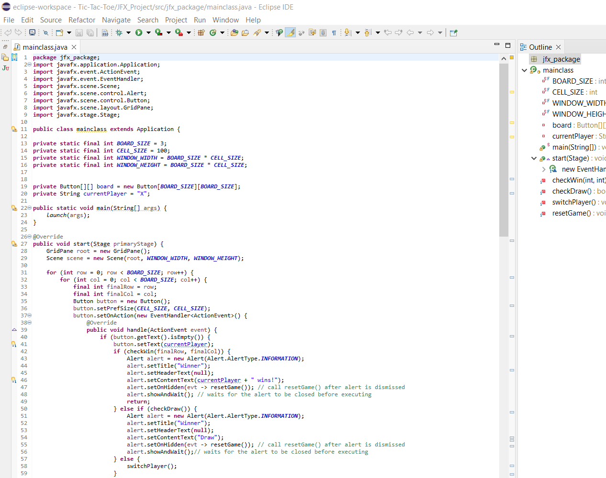

# Personal Portfolio - Nayan Bisessar

Welcome to my personal portfolio! This website serves as a showcase of my skills, projects, and experiences as a Computer Science student. Feel free to explore and get to know more about me.

## Table of Contents

- [Navigation](#navigation)
- [Profile](#profile)
- [About Me](#about)
- [Projects](#projects)
- [Contact Me](#contact)
- [Footer](#footer)

## Navigation

### Desktop Navigation
- Home
- About
- Projects
- Contact

### Mobile Navigation
- Home
- About
- Projects
- Contact

## Profile

- **Name:** Nayan Bisessar
- **Role:** Computer Science Student
- [Resume](./assets/Resume(Nayan Bisessar).pdf)

### Social Media
- [LinkedIn](https://linkedin.com/in/nayan-bisessar)
- [GitHub](https://github.com/nayanbisessar)

## About Me

I am Nayan Bisessar, a third-year Computer Science major with a passion for full-stack development. Eager to take on new challenges, I am committed to expanding my knowledge base and contributing to meaningful projects. Learn more about me through my skills, education, and extracurriculars.

### Skills
- Programming Languages: Java, Python, JavaScript, HTML, CSS, SQL
- Software: Visual Studio, Eclipse, MySQL, VirtualBox, IntelliJ, Wireshark, Spyder
- Systems: Windows, Linux

### Education
- Bachelor of Science in Computer Science at Wentworth Institute of Technology (2022 - 2025)

### Extracurriculars
- Member of SHPE (Society of Hispanic Professional Engineers) - 2023 to Present
- Fitness enthusiast and regular gym-goer - 2021 to Present

## Projects

### Portfolio Project

- [GitHub Repository](https://github.com/nayanbisessar/html-css-js-portfolio)

### Tic-Tac-Toe Project

- [GitHub Repository](https://github.com/nayanbisessar/Tic-Tac-Toe/blob/main/Tic-Tac-Toe/JFX_Project/src/jfx_package/mainclass.java)

## Contact Me

Feel free to reach out! Whether you have questions about my projects or potential collaboration opportunities, I am just a message away.

**Contact Form:**
- Name
- Email
- Message
- [Send Message](#)

## Footer

&copy; 2024 NSB. All rights reserved.

---

*Note: This portfolio is designed and maintained by Nayan Bisessar.*
